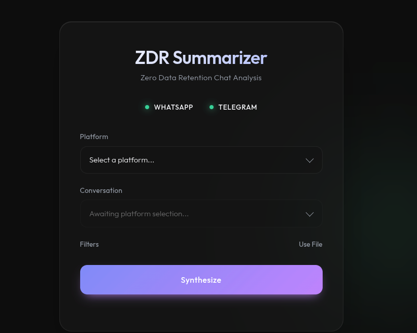

# ✨ ZDR Chat Summarizer

An ethereal, modern, and *privacy-first* web application for intelligent chat extraction and summarization. Designed with the **ZDR (Zero Data Retention)** philosophy: your messages are never persistently saved to disk.



## 🌟 Key Features

- **Zero Data Retention**: Messages are processed exclusively in volatile memory (RAM). No permanent storage.
- **Headless WhatsApp Web Integration**: Real-time synchronization and automatic chat selection via `whatsapp-web.js` (no need to manually export TXT files).
- **Telegram MTProto Integration**: Fast and direct cloud extraction leveraging the official Telegram API via `GramJS`.
- **Premium Ethereal UI**: A meticulously crafted user interface featuring glassmorphism, interactive animated backgrounds, and an ultra-modern feel.
- **Offline Fallback Mode**: Supports manual uploads of classic `.txt` (WhatsApp) or `.json` (Telegram) files if you prefer not to use automations.
- **Advanced Time Filtering**: Automatically select the time range of messages to analyze before sending them to the synthesis engine.

## 🛠 Technology Stack
- **Backend**: Node.js, TypeScript, Express
- **Client Automation**: Puppeteer, whatsapp-web.js (master branch), GramJS
- **Data Parsing**: `stream-json`, pipeline and stream-based architecture to handle massive amounts of messages without overwhelming memory.
- **Frontend**: Responsive, ultra-lightweight Vanilla HTML/CSS/JS, featuring Google's *Outfit* font.

## 🚀 Installation and Setup

1. **Clone the project**
   ```bash
   git clone https://github.com/your-username/msg_summarizer.git
   cd msg_summarizer
   ```

2. **Install dependencies**
   ```bash
   npm install
   ```

3. **Configure Environment Variables**
   Create a `.env` file in the root of the project (this will never be pushed to GitHub for security):
   ```env
   # Telegram API Keys (Get them at my.telegram.org)
   TELEGRAM_API_ID=your_api_id
   TELEGRAM_API_HASH=your_api_hash
   
   # The session string will be generated on your first run!
   TELEGRAM_STRING_SESSION=
   ```

4. **Start the Development Server**
   ```bash
   npm run dev
   ```

5. **Initial Authentication (First run only)**
   - **Telegram**: Follow the terminal instructions to enter your phone number and OTP code. Upon completion, you will receive a very long *Session String*. Copy it, paste it into your `.env` file under `TELEGRAM_STRING_SESSION`, and restart.
   - **WhatsApp**: Scan the QR Code that appears in the terminal using the WhatsApp app on your phone.

6. **Enjoy the Magic**
   Open your browser at [http://localhost:3000](http://localhost:3000) and start analyzing!

## 🔐 Security & Privacy
The Zero Data Retention philosophy ensures that the server acts solely as a *bridge* between your account and the language engine. Any temporary files generated for analysis (such as during manual uploads) are saved in `/tmp` and destroyed immediately once the RAM extraction is complete. Your login sessions are saved locally in secure files ignored by `.gitignore`.

---
*Project developed as an exploratory tool for secure and private AI/bot integrations.*
